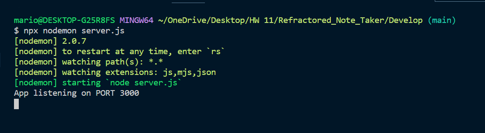
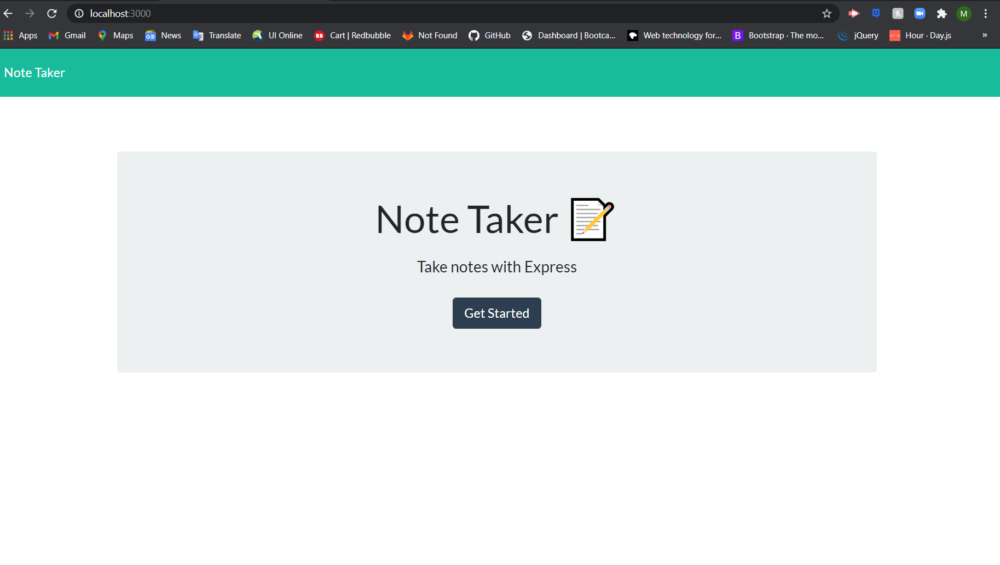
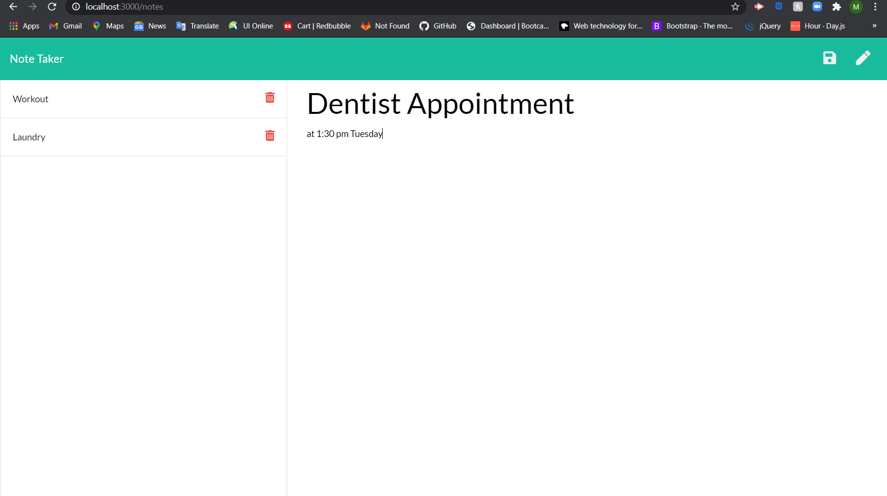
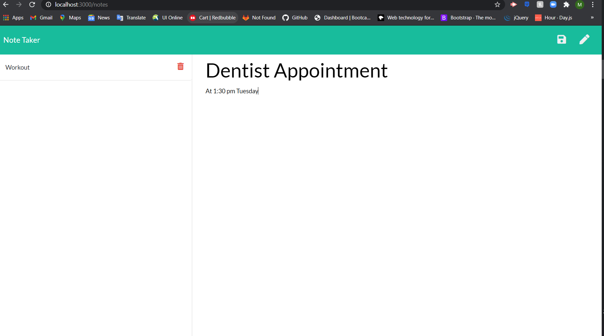

# note_taker

## Table of Contents 

[Description](#description)

[Installation](#installation)

[Usage](#usage)

[Screenshots](#screenshots)

[Questions](#questions)

## Description 

In this application, you have a fun and interactive way to keep tracks of any information you might need to keep track of through the day. With this Note Taker you can keep notes of either things that you might need to get done later or information that you will need to remember at another time and save those notes. Also with the Note Taker your notes are kept safe with data persistence, so your notes will not disappear until you delete your note.

## Installation 

To install the necessary dependencies, run the following command:

----------
npm i
----------

## Usage 

Once everything is installed, make sure to change into the Develop directory and run 

-------------------------
npx nodemon server.js
-------------------------

before starting application's URL.

## Screenshots

## Questions 

If you have any questions about the repo, open an issue or contact me directly at mlavina91@gmail.com. 
You can find more of my work at (https://github.comLavina91/).